# Linux Kernel Compilation Guide 

# About:
This is a walkthrough to compiling linux kernel with a custom wrapper of mkdir command .Given to us as our Operating system assignment . To get a know how of linux kernel compilation .     

## **Syscall :**

The syscall that we chose was **mkdir** on kernal version 5.1 (***5.15.196**to be exact)*

#### MKDIR :

 This command is used to make directories if it doesn’t exist already on a desired path or in your current directory .

*MAN PAGE :*

```bash 
NAME
       mkdir - make directories

SYNOPSIS
       mkdir [OPTION]... DIRECTORY...

DESCRIPTION
       Create the DIRECTORY(ies), if they do not already exist.

       Mandatory arguments to long options are mandatory for short options too.

       -m, --mode=MODE
              set file mode (as in chmod), not a=rwx - umask

       -p, --parents
              no  error  if  existing,  make parent directories as needed, with
              their file modes unaffected by any -m option

       -v, --verbose
              print a message for each created directory

       -Z     set SELinux security context of each created directory to the de‐
              fault type

       --context[=CTX]
              like -Z, or if CTX is specified then set the SELinux or SMACK se‐
              curity context to CTX

       --help display this help and exit

       --version
              output version information and exit

AUTHOR
       Written by David MacKenzie.

```


##  **Importance :**

The mkdir operation is particularly important as:
- File system management is core to OS functionality

- Directory creation is frequently used in applications

- It demonstrates file system interaction patterns

**Kernel-Level Significance:**
- **VFS (Virtual File System) Integration**: mkdir interacts with the VFS layer, demonstrating how Linux abstracts different filesystems
- 
- **Inode Management**: Each directory creation involves inode allocation and metadata management
## **Documentation :** 

### Environment Setup

Install any linux distribution iso and set upa Virtual Machine in VirtualBox/Vmware (we could do it on our host machine but we may also end up curropting grup or disrupting our own kernal image) .
make sure to give your machine at least these specs 
```
RAM : 8gigs , 12 if you can 
Storage : 80GB
CPU CORES : at least 4 , as many as you can ...
```

Next install the desired linux kernel image (tarball) from 

Link : [images ](kernel.org)

Extract it and 
```bash 
cd linux-5.15.196
```

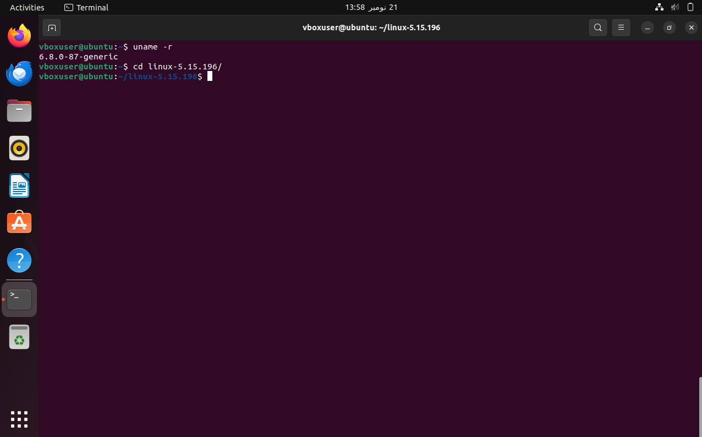

Install the Dependencies 

```bash
sudo apt-get install git fakeroot build-essential ncurses-dev xz-utils libssl-dev bc flex libelf-dev bison
```

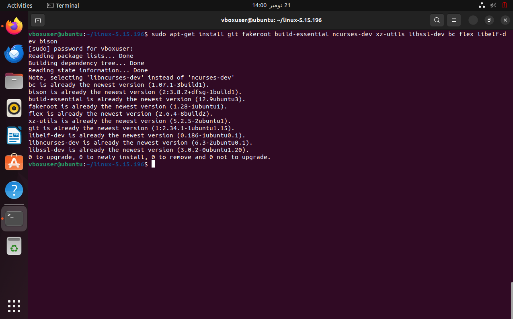

The command we used above installs the following packages:

|                                            |                                                                                                                                                                                        |
| ------------------------------------------ | -------------------------------------------------------------------------------------------------------------------------------------------------------------------------------------- |
| **Package**                                | **Package description**                                                                                                                                                                |
| **git**                                    | Tracks and makes a record of all changes during development in the source code. It also allows reverting the changes.                                                                  |
| **fakeroot**                               | Creates the fake root environment.                                                                                                                                                     |
| **build-essential**                        | Installs development tools such as [C](https://phoenixnap.com/glossary/c-programming-language), [C++](https://phoenixnap.com/glossary/c-plus-plus-programming-language), gcc, and g++. |
| **ncurses-dev**                            | Provides [API](https://phoenixnap.com/glossary/api-definition) for the text-based terminals.                                                                                           |
| **xz-utils**                               | Provides fast [file compression](https://phoenixnap.com/glossary/file-compression) and [file decompression](https://phoenixnap.com/glossary/file-decompression).                       |
| **libssl-dev**                             | Supports [SSL and TSL](https://phoenixnap.com/kb/tls-vs-ssl) that [encrypt](https://phoenixnap.com/glossary/encryption-definition) data and make the internet connection secure.       |
| **bc** (Basic Calculator)                  | Supports the interactive execution of statements.                                                                                                                                      |
| **flex** (Fast Lexical Analyzer Generator) | Generates lexical analyzers that convert characters into tokens.                                                                                                                       |
| **libelf-dev**                             | Issues a shared library for managing ELF files (executable files, core dumps and object code)                                                                                          |
| **bison**                                  | Converts grammar description to a C program.                                                                                                                                           |
###  Wrapper Func

Now to add our own wrapper function we need to change 2 files , one is 

**fs/namei.c** : Contain defination for all the syscalls 
So we add our  custom call wrapper in this file jsut above our orignal mkdir defination  
```c
// ============================================================================
// CUSTOM SYSTEM CALL WRAPPER - MINIMAL VERSION
// Student ID: 232045_232050
// ============================================================================
SYSCALL_DEFINE2(mkdir_2045_2050, const char __user *, pathname, umode_t, mode)
{
    printk(KERN_INFO "CUSTOM MKDIR (ID: 2045_2050): System call invoked\n");
    return do_mkdirat(AT_FDCWD, getname(pathname), mode);
}
```


**arch/x86/entry/syscalls/syscall_64.tbl:** Containt the link to all the syscalls 
We gonna add link to our custom defined syscall here 

```c
451	common	mkdir_2045_2050		sys_mkdir_2045_2050
```

At first i tried to overwrite the orignal 'mkdir' entry in syscall table , but i failed at boot time cause it was looking for mkdir instead of my custom version . So I just add the new entry on with an unused & unreserved number i.e 451
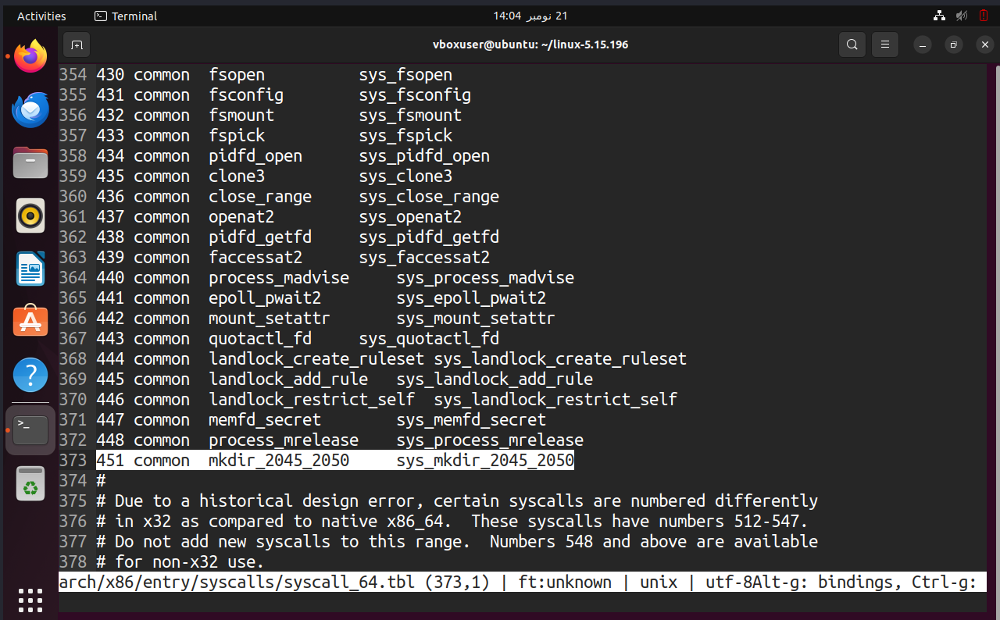
make sure to add it in right number position i.e    452 > 451 >450 
### Compilation Setup

In your installed kernel directory 
1.  Copy the current linux configuration file  
```bash
cp -v /boot/config-$(uname -r) .config
```


2. To make changes to configuration file run 
```bash 
make menuconfig

# we dont really need to change anything here so just <save> and <Exit>
# navigation by tab , arrow keys , and enter 
```

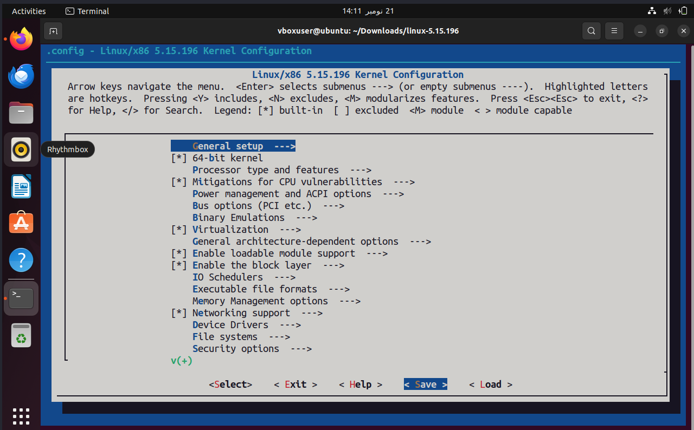


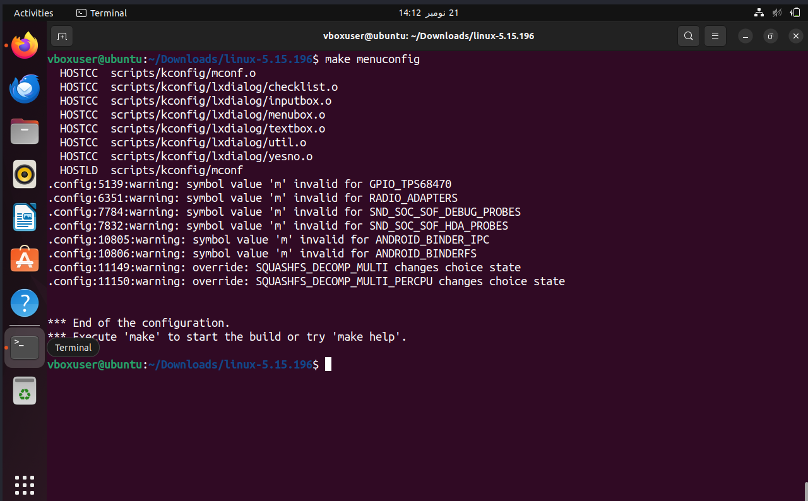

3. Next step is to compile our kenel but we will probably get an error about certification why 
	- **Secure Boot**: Modern kernels require signed modules for security
	- **Module Signing**: Prevents loading of malicious kernel modules
	- **Development vs Production**: For development, we disable these checks
	
```bash
No rule to make target 'debian/canonical-certs.pem
```

	To eliminate that 
	run 

```bash 
# Disable problematic certificate options
scripts/config --disable SYSTEM_TRUSTED_KEYS
scripts/config --disable SYSTEM_REVOCATION_KEYS
scripts/config --set-str SYSTEM_TRUSTED_KEYS ""
scripts/config --set-str SYSTEM_REVOCATION_KEYS ""
```


4. Now we can build or kernel 
```bash 
make 

#OR

make -j$(nproc) #speed up our compilation by max utilizing our cpu
```


	It will take a lot of time for me it took like 2-4 hours to compile sometime(it's just 70-90 mins , dont know why ) 


5.  Installing the required modules 
   ```bash
   sudo make modules_install
   ```

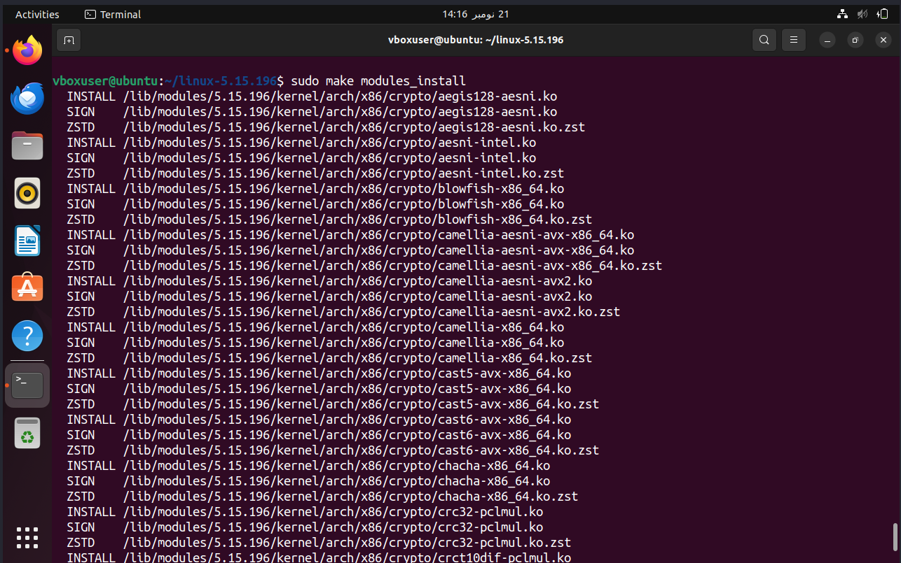

5. Finally install the kernel 
```bash
sudo make install
# The make install also update the grup loader but just to be safe 
sudo update-grub
```

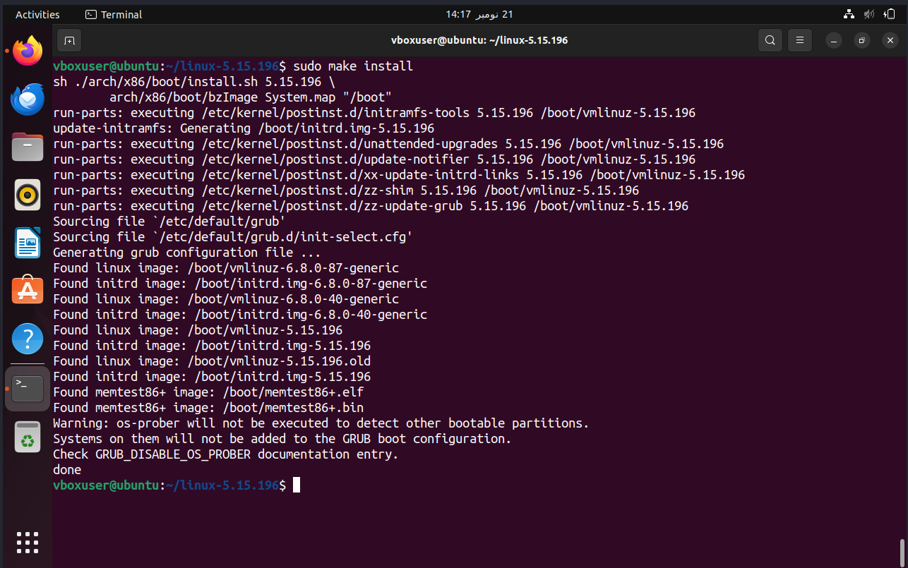


### Booting 
 Now we reboot to our machine and enter boot menu 
	1.  `sudo reboot -f`
	2.  While the machine is rebooting , hold both shifts to enter boot menu 
	3. Select Advanced options -> boot into your newly installed kernel 
	4.  After machine boots up check with `uname -r` you will see your installed kernel version 


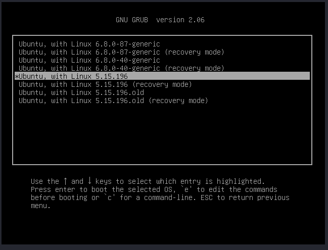

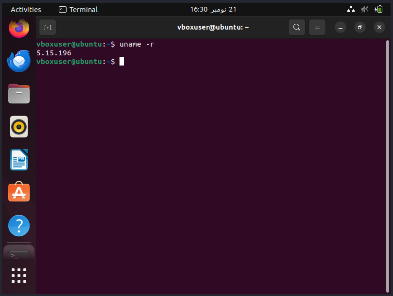


### Testing our wrapper 

1.  made a simple C function that will call our wrapper syscall 
		 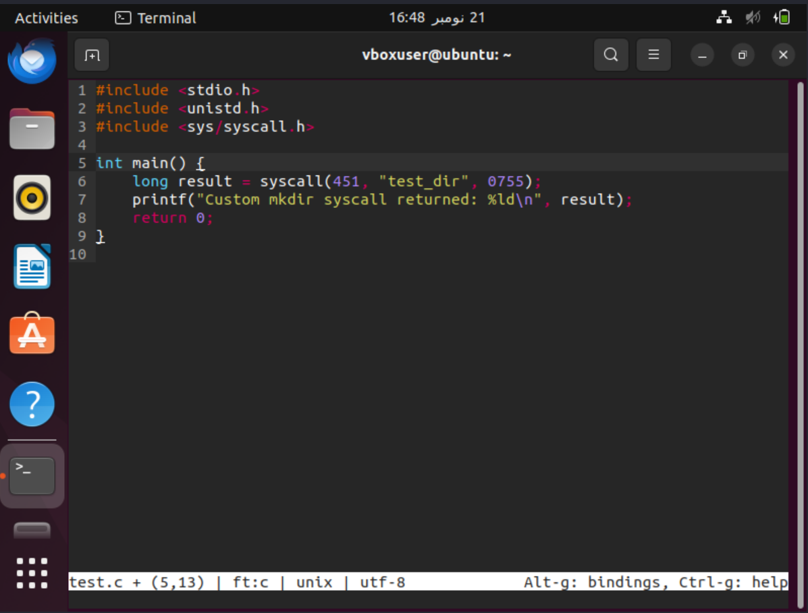
```C
#include <stdio.h>
#include <unistd.h>
#include <sys/syscall.h>

int main() {
    long result = syscall(451, "test_dir", 0755);
    printf("Custom mkdir syscall returned: %ld\n", result);
    return 0;
}
```
	
2.  As we can clearly see in below screenshot our syscall wrapper works fine 
		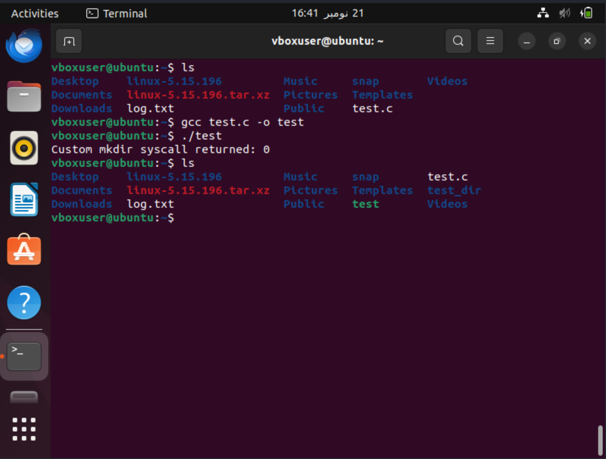

3.  Kernal Logs  , our desired kernel logs have also been produced 
		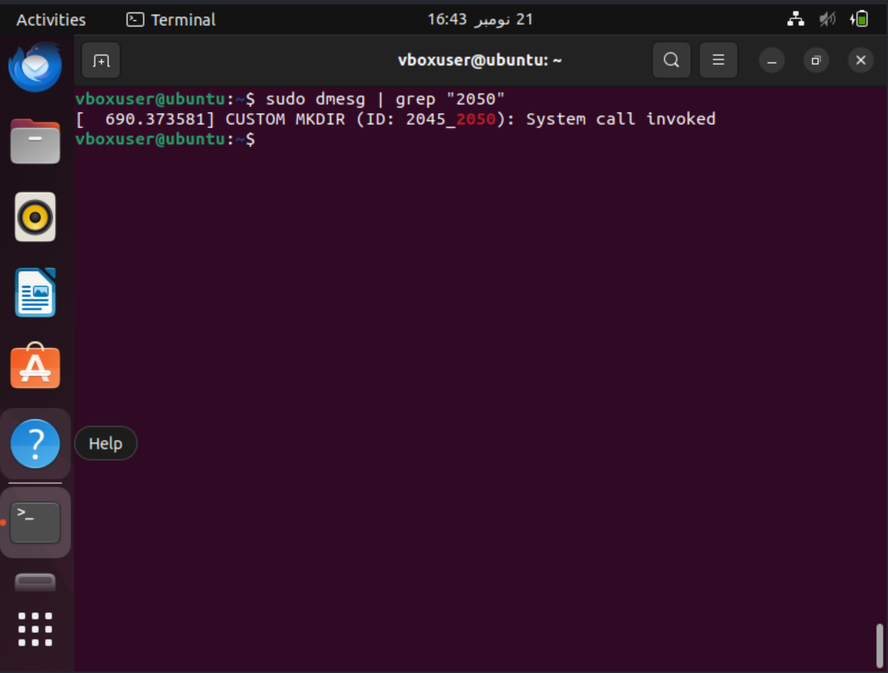


#### And thats All . . .

### Extra commands 

```bash
make clean #IF you have to break your compiling at some point or you get an error make sure to trun this and then compile again 
```

```bash
time make -j$(nproc) # To measure the time it take to compile 
```

```bash 
make -j$(nproc) | tee -a log.txt # to throw all the ourput of compilation to a log file  , jsut used it for debugging at som point 
```


<h2 style={{textAlign: 'center'}}>__END__</h2>


